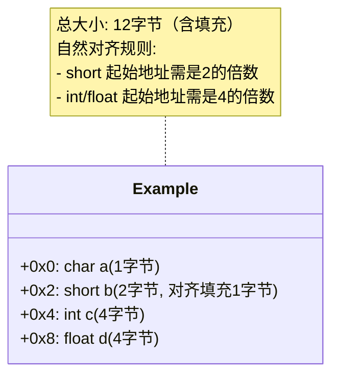
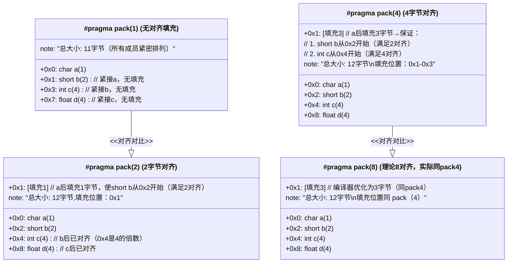
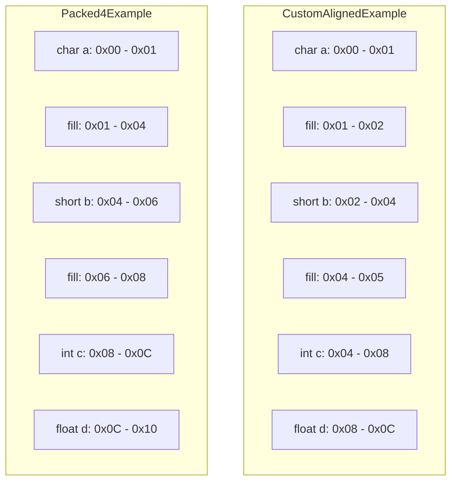

# 字节对齐

在计算机中，内存是以字节为基本单位进行编址的，不同类型的数据占用不同数量的字节。**字节对齐要求数据的起始地址必须是该数据类型大小的整数倍**。

## 常见的字节对齐方式

### `#pragma pack` 指令

`#pragma pack` 是一种编译器指令，用于显式控制结构体或联合体（`union`）成员的对齐方式。

### 自然对齐

> 自然对齐：指数据类型按照其自身的对齐字节数存储。

每个数据类型都有一个固定的对齐字节数：

1. `char`:1字节对齐
2. `short`:2字节对齐
3. `int`:4字节对齐
4. `float`:4字节对齐
5. `double`:8字节对齐
6. 指针：4/8 字节对齐（取决于32位或者64位）

```c
struct Example {
    char   a;     // 1字节对齐
    short  b;     // 2字节对齐
    int    c;     // 4字节对齐
    float  d;     // 4字节对齐
};
```
按照自然对齐，上面的结构体在内存中的地址和大小如下：



### 编译器指令对齐——1/2/4/8 字节对齐

1/2/4/8 字节指的是数据在内存中以 1/2/4/8 字节为单位进行对齐。

```c
#pragma pack(1)
struct PackedExample {
    char   a;     // 1字节对齐
    short  b;     // 2字节对齐，但被强制为1字节对齐
    int    c;     // 4字节对齐，但被强制为1字节对齐
    float  d;     // 4字节对齐，但被强制为1字节对齐
};


#pragma pack(2)
struct Packed2Example {
    char   a;     // 1字节对齐
    short  b;     // 2字节对齐
    int    c;     // 4字节对齐，但被强制为2字节对齐
    float  d;     // 4字节对齐，但被强制为2字节对齐
};

#pragma pack(4)
struct Packed4Example {
    char   a;     // 1字节对齐
    short  b;     // 2字节对齐，但被强制为4字节对齐
    int    c;     // 4字节对齐
    float  d;     // 4字节对齐
};

#pragma pack(8)
struct Packed8Example {
    char   a;     // 1字节对齐
    short  b;     // 2字节对齐，但被强制为8字节对齐
    int    c;     // 4字节对齐，但被强制为8字节对齐
    float  d;     // 4字节对齐，但被强制为8字节对齐
};
```

上面4种不同对齐方式，结构体成员在内存中的布局如下



### 自定义对齐

除了自然对齐和编译器指令对齐，C 语言还允许通过特定属性或扩展手动设置变量或结构体的对齐方式。例如`GCC`编译器支持使用`_attribute_((aligned(n)))`来指定对齐字节数。

```c
typedef struct __attribute__((aligned(4))) {
    char   a;
    short  b;
    int    c;
    float  d;
} CustomAlignedExample;

CustomAlignedExample var;
```
强制 `var` 结构体按照 4 字节对齐，确保其在内存中的起始地址是 4 字节的倍数。

这个似乎看起来和`#pragma pack(4)`一样都是 4 字节对齐。它们有什么区别呢？

#### `__attribute__((aligned(2n)))`和`#pragma pack(2n)`的区别

|区别|`__attribute__((aligned(2n)))`|`#pragma pack(2n)`|
|-|-|-|
|对齐范围|主要影响结构体整体的对齐，不影响结构体内部成员的对齐方式。成员仍然按照各自的自然对齐方式。|强制结构体的每个成员按照4字节对齐，忽略成员的自然对齐需求。|
|编译器兼容|主要用于GCC编译器|更通用的指令，受到多种编译器的支持|


这两个结构体在内存布局如下图所示



## 结构体对齐

在 C 语言中，字节对齐主要就涉及到的就是结构体对齐。

> 结构体对齐主要是为了确保结构体中每个成员按照其自然对齐方式存储，以便提高`CPU`高效访问内存。


### 结构体大小

**结构体的总字节数是所有成员对齐后的总和，并且至少是最大成员对齐字节数的倍数**

### 结构体对齐的方式——4 字节对齐


```c

```


## 联合体对齐

## 数组对齐

