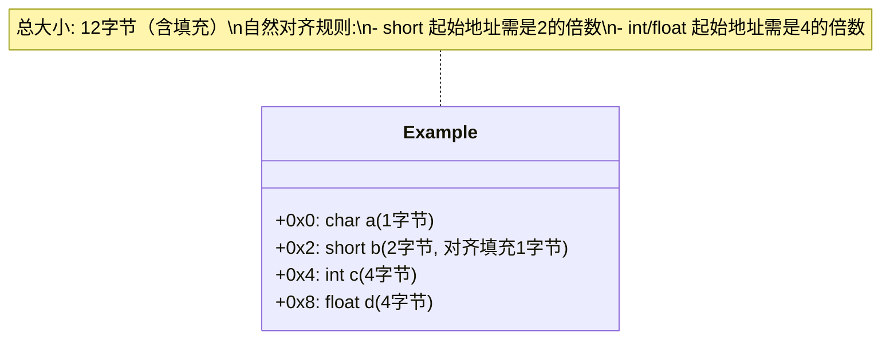

# 字节对齐

在计算机中，内存是以字节为基本单位进行编址的，不同类型的数据占用不同数量的字节。**字节对齐要求数据的起始地址必须是该数据类型大小的整数倍**。

## 常见的字节对齐方式

### 自然对齐

> 自然对齐：指数据类型按照其自身的对齐字节数存储。

每个数据类型都有一个固定的对齐字节数：

1. `char`:1字节对齐
2. `short`:2字节对齐
3. `int`:4字节对齐
4. `float`:4字节对齐
5. `double`:8字节对齐
6. 指针：4/8 字节对齐（取决于32位或者64位）

```c
struct Example {
    char   a;     // 1字节对齐
    short  b;     // 2字节对齐
    int    c;     // 4字节对齐
    float  d;     // 4字节对齐
};
```

因此其在内存中的地址如下


## 结构体对齐

在 C 语言中，字节对齐主要就涉及到的就是结构体对齐。

> 结构体对齐主要是为了确保结构体中每个成员按照其自然对齐方式存储，以便提高`CPU`高效访问内存。


### 结构体大小

**结构体的总字节数是所有成员对齐后的总和，并且至少是最大成员对齐字节数的倍数**

### 结构体对齐的方式——4 字节对齐


### `#pragma pack` 指令

`#pragma pack` 是一种编译器指令，用于显式控制结构体或联合体（`union`）成员的对齐方式。

```c

```


## 联合体对齐

## 数组对齐

