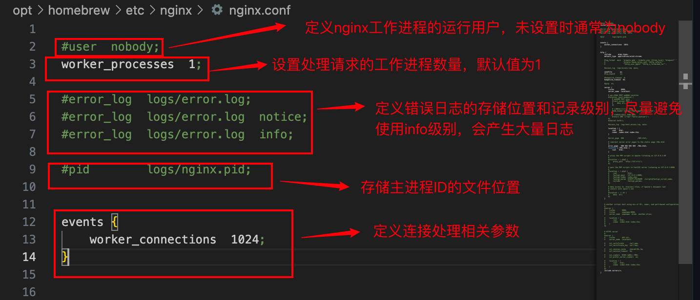
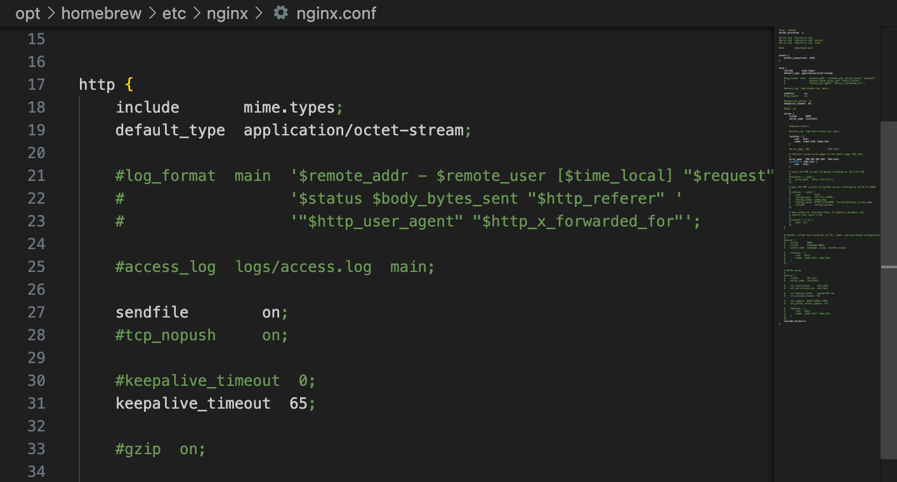
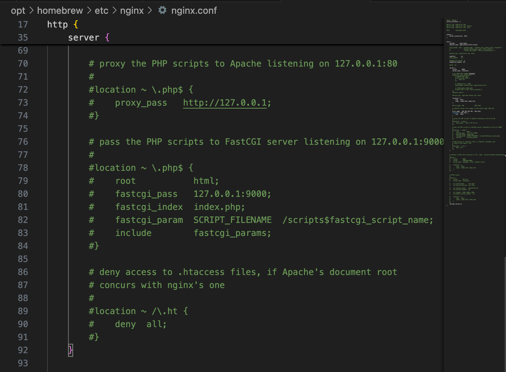
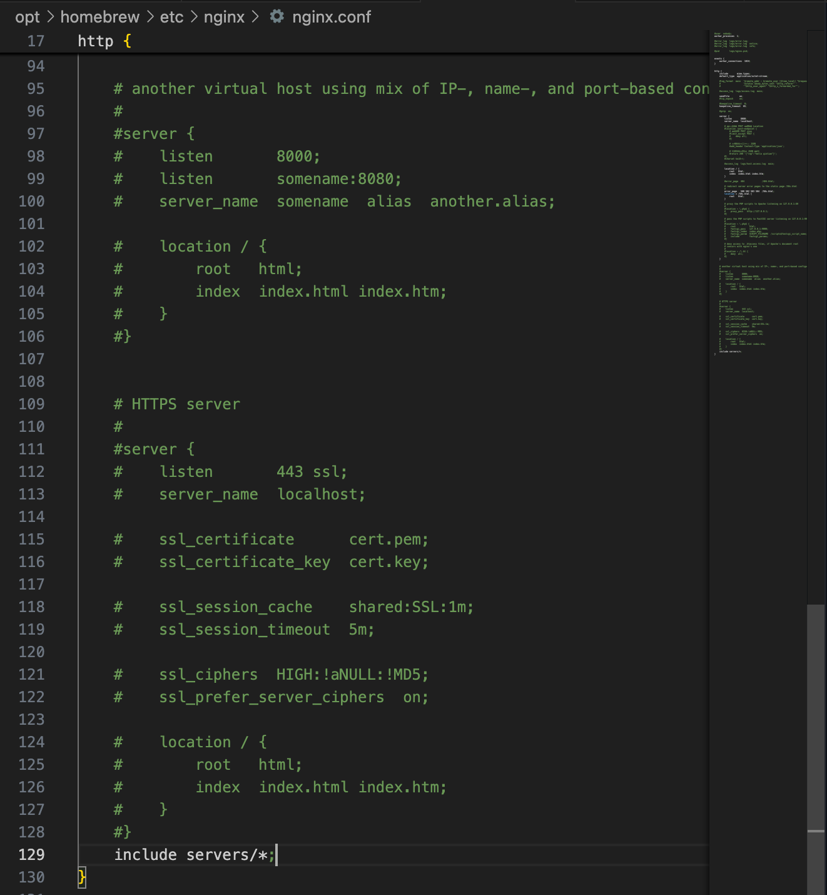

# Nginx 

## 1、Nginx 基本概念

> Nginx 是一个高性能的 HTTP 和反向代理的 Web 服务器。特点是占有内存小，并发能力强。


### 1.1、正向代理与反向代理

> 代理服务器：介于客户端和服务器之间的中间服务器，用来转发请求。


|代理分类|概念|特点|应用场景|
|-|-|-|-|
|正向代理|代表客户端向服务器发送请求，客户端主动配置代理地址|<li>隐藏客户端身份：服务器仅看到代理的 IP，而非真实客户端。<li>访问控制：限制或监控客户端访问特定资源（如企业网络管理）<li>绕过限制：突破地域或网络封锁（如访问被屏蔽的网站）<li>正向代理关注客户端隐私和控制|<li>公司内网通过代理访问外网。<li>用户通过 VPN 或科学上网工具访问受限内容|
|反向代理|代表服务器接收客户端请求，在服务端配置，对客户端透明|<li>隐藏服务器身份：客户端仅接触代理，无法直接访问后端服务器<li>负载均衡：将请求分发到多个后端服务器<li>安全防护：作为安全层抵御 DDoS 攻击、过滤恶意流量<li>SSL终端：处理 HTTPS 加密/解密，减轻后端压力<li>反向代理侧重服务端的负载与安全|<li>高流量网站使用 Nginx 处理并发请求|

## 2、环境搭建
### 2.1、MacOS 搭建 nginx

在 Mac 上安装 nginx，首先需要安装 Homebrew。关于这个包管理器的相关说明，可以参考 [Homebrew](https://github.com/SolaTian/MacOS/blob/main/Homebrew.md)


#### 2.1.1、安装 nginx

使用命令`brew install nginx`安装 nginx，安装完成之后，使用`brew info nginx`查看nginx 的安装信息如下图所示


在图上可以查看到几点重要的信息


#### 2.1.2、打开 nginx 配置文件

使用 `open /opt/homebrew/etc/nginx` 打开配置文件所在目录


#### 2.1.3、打开 nginx 安装目录

使用 `open /opt/homebrew/Cellar/nginx`


安装目录下有个 html 文件夹，里面存放着 2 个 html 文件，其中 index.html 是 nginx 的欢迎页面，50x.html 是 nginx 的报错页面。


#### 2.1.4、启动 nginx 服务

在命令行中启用 nginx 

`brew services start nginx`


后续再次启动 nginx 时可以先执行命令 `brew services stop nginx`

如果手动修改了 nginx.conf 文件，则在启动 nginx 之前，可以先使用 `nginx -t` 检查一下 nginx.conf 是否存在语法错误


启动完 nginx 之后，可以通过`ps -ef | grep nginx` 命令查看进程是否启用成功。


#### 2.1.5、关闭和重启 nginx 服务

使用 `brew services stop nginx` 和 `brew services restart nginx` 分别对 nginx 进行关闭或者重启


#### 2.1.6、访问 nginx

了解 nginx 的基本操作之后，后面就可以使用浏览器访问 nginx 了


### 2.2、Windows 搭建 nginx


## 3、nginx.conf 内容详解

下面逐行的来看下 nginx.conf 文件中有哪些内容



1. 定义错误的存储位置和日志级别：

    >   error > warn > notice > info > debug

    合理设置日志路径，避免使用 info 级别，会产生大量的日志

2. `events`参数定义连接处理相关的参数，有以下几个关键参数
   - `worker_connections`：单个工作进程的最大并发连接数  
   - `multi_accept`：是否一次性接受所有新连接（建议`on`）
   - `use`：指定事件模型（如`epoll`）




3. `include mime.types`：加载预定义的 MIME 类型文件（如 .html → text/html）

4. `default_type`：当无法识别文件类型时，默认返回 `application/octet-stream`（浏览器会触发下载行为）

5. `log_format`：定义日志的格式模板（此处命名为 main）
6. `access_log`：启用访问日志并指定路径和格式
7. `sendfile`：启用零拷贝技术，提升静态文件传输效率
8. `tcp_nopush`：仅在 `sendfile on` 时生效，优化网络包发送机制
9. `keepalive_timeout`：控制客户端连接的保持时间。0 表示禁用 `Keep-Alive`
10. `gizp on`: 启用响应内容压缩，减少传输体积。当开启时，还可以设置一些额外的参数，比如压缩等级，最小压缩文件大小等。


11. `listen 8080; server_name localhost;`:定义一个虚拟主机，接收发送到`localhost:8080`的请求。`server_name`支持多域名/IP

12. `location /post-endpoint`: 注释部分为请求部分，表示仅允许使用 POST 方法，且设置了返回类型和返回响应。
13. `charset koi8-r`：
14. `location /`：静态服务资源，访问`http://localhost:8080/` → 返回 `index.html`
15. `error_page`: 错误页面配置，返回`50x.html`

 

16. 注释部分为 php 支持，暂不研究



17. 第二个 `server` 指定了混合监听模式：通过 `listen` 指令定义了两种监听方式：
`8000` 端口（默认监听所有 IP），`somename:8080`（监听特定 IP/主机名 `somename` 的 8080 端口）。域名匹配：`server_name` 定义了匹配的域名：主域名 `somename`别名 `alias` 和 `another.alias`

18. 请求处理：`location /` 表示处理所有路径的请求：静态文件根目录为 html（默认相对路径）。默认索引文件为 `index.html` 和 `index.htm`

19. `SSL` 加密通信：监听 443 端口并启用 `SSL`（`listen 443 ssl`）证书文件 `cert.pem` 和私钥文件 `cert.key`(这里使用的是相对路径，建议使用绝对路径，如 `/opt/nginx/ssl/cert.pem`)

20. 性能优化：`SSL` 会话缓存（`shared:SSL:1m` 允许 1MB 内存存储约 4000 个会话）会话超时 5 分钟（5m）

21. 安全增强：加密套件策略 `HIGH:!aNULL:!MD5`（禁用弱算法）优先使用服务端加密套件（`ssl_prefer_server_ciphers on`）
22. `include server/*`：加载 `servers` 目录下的所有配置文件


## 4、搭建一个通用的 nginx 服务器

上面已经初步的介绍了 nginx 自带的 nginx.conf 文件，通过这个文件，可以在电脑上启用 nginx 服务。也就是说，只要修改这个配置文件，就能获得完全不一样的服务端。

### 4.1、丰富多样的协议

在客户端开发时，常常会有各种各样的平台或者服务端协议。设想一下，如果能够在这些协议中抽象出一些通用的参数选项保存在一个如`protocol_para.conf`文件中，比如 `protocol=...`，是不是只要根据协议种类手动的修改一下如`protocol=HTTP`或者`protocol=HTTPS`。通过这种方式，可以将各种协议都抽象成一种标准的`conf`文件。抽象出来的参数选项越多，那么这个`protocol_para.conf`文件适用的协议类型就越多。

#### 4.1、总结自己的 protocol_para.conf 文件

万事开头难，想要用 nginx 来自动化搭建对应协议的服务端 demo ，就需要尽可能多的对这些协议进行总结。下面只从笔者日常开发中遇到的协议来进行总结，后续遇到新的协议，可以在 `protocol_para.conf`文件中继续总结


应用层：
1. HTTP 协议（是否支持认证等）
2. HTTPS 协议
3. 私有协议 （如结构体+数据）

传输层：
1. TCP（分为短连接和长连接）

数据格式还可以包括 基础的二进制、RSA 加密、AES 加密、base64 转码，UTF8转码等。

协议内容很多，可以根据不同的应用层协议分成不同的文件，如 HTTP 和 HTTPS 使用`protocol_http.conf`，私有协议使用


#### 4.2、从最基本的 HTTP 开始

上面已经介绍过了 nginx 自带的配置文件。现在设想一个最基本的 HTTP 场景

1. 客户端发送请求，方法为：`POST/GET/PUT /test/uri`
2. 客户端数据传输方式为：请求体
3. 客户端数据格式与结构：`JSON`/`XML`/原始数据
4. 服务端对于客户端的头部进行必要的检查：
   - `uri` 校验（必要）
   - `Content-Length`校验（必要）
   - `Content-Type`校验（非必要）
5. 服务端可以查看对应的错误日志，并且可以在浏览器上显示出相应的成功或者失败页面。

这个场景就是最基本的 HTTP 交互场景。

可以看到上面的交互流程中主要包括几个部分，即

1. 路由
2. 请求头、请求体的部分校验
3. 请求体的处理
4. 日志

##### 4.2.1、路由

先看路由，需要支持 `POST/GET/PUT` 方法的 `"/test/uri"`，那么 nginx 在处理这个请求的时候，需要返回什么呢？返回一个 `200 OK/404 not found` 的 Web 页面提示，还是其他后端程序的处理，比如客户端发送了一张图片，需要后端程序读取之后返回`nginx`。

这两种返回分别属于不同的处理方式，第一种返回了固定的资源，第二种返回了定制化的处理资源。第一种称为`static`，第二种称为`dynamic`。`dynamic`是特定的程序去处理客户端的请求。为了具有通用性，我们的`"/test/uri"`应该属于是`dynamic`。即

``` ini
[routes]
"/test/uri" = dynamic|_internal_handler  methods=GET,POST,PUT
```
将 `"/test/uri"`标记为动态处理器，此处由 `Nginx` 直接处理响应。

##### 4.2.2、请求

服务端需要设置的关于请求的，需要包括，请求体的最大限制。允许的`Content-Type`类型。是否校验头部的`Content-Length`。即

``` ini
[request]
max_body_size = 10M       # 允许的最大请求体
allowed_content_types = application/json, text/xml, application/octet-stream
body_buffer_size = 16K    # 请求体缓冲区大小
require_content_length = true  # 强制校验Content-Length头
```
##### 4.2.3、日志

需要包括访问日志和错误日志，以及日志的格式。如下：

``` ini
[logging]
access_log = /var/log/http_access.log
error_log = /var/log/http_error.log
log_format = "%t %a %m %U %s %B %D"
```

##### 4.2.4、完整的 protocol_http.conf 文件

结合上面的几个参数模块，加上上面分析的 `nginx.conf` 文件中需要的一些基本监听地址、端口、性能调优等参数。生成最后的`protocol_http.conf` 文件。

``` ini
[Application]     # 对应nginx.conf中的server
enabled = true          # 是否启用
server_ip = 0.0.0.0     # 监听所有的网络接口
listen_port = 80        # 监听端口

[routes]
"/test/uri" = dynamic|_internal_handler methods=GET,POST,PUT

[request]
max_body_size = 10M
allowed_content_types = application/json, text/xml, application/octet-stream
body_buffer_size = 16K
require_content_length = true  # 新增必要校验开关

[performance]
max_connections = 100   # 最大并发连接数
connection_timeout = 30s # 连接超时时间

[logging]
access_log = /var/log/http_access.log
error_log = /var/log/http_error.log
log_format = "%t %a %m %U %s %B %D"

[debug]
enable_request_dump = false   # 关闭请求内容记录，在生产环境中关闭调试日志
```

#### 4.3、转化脚本

有了上面的 `protocol_http.conf` 文件，就需要用一个脚本将上面的配置文件转换成为
`nginx.conf`文件。

Python 脚本文件如下：

``` python
#!/usr/bin/env python3
"""
protocol_http.conf 到 nginx.conf 转换脚本 (最终修复版)
"""

import configparser
from pathlib import Path

def load_config(config_path):
    cfg = configparser.ConfigParser(interpolation=None)
    cfg.read(config_path)
    return cfg

def generate_nginx_config(cfg):
    output = []
    
    # ===== 基础配置 =====
    worker_procs = cfg.get('performance', 'worker_processes', fallback='auto').strip()
    output.append(f"worker_processes {worker_procs};")  # 确保分号结尾
    
    output.append("events {")
    max_conn = cfg.get('performance', 'max_connections', fallback='1024').strip()
    output.append(f"    worker_connections {max_conn};")  # 分号结尾
    output.append("}\n")
    
    output.append("http {")
    output.append("    include       mime.types;")
    output.append("    default_type  application/octet-stream;\n")
    
    # ===== 日志配置 =====
    log_format = cfg.get('logging', 'log_format', fallback='%t %a %m %U %s %B %D') \
        .replace('%t', '$time_local') \
        .replace('%a', '$remote_addr') \
        .replace('%m', '$request_method') \
        .replace('%U', '$uri') \
        .replace('%s', '$status') \
        .replace('%B', '$body_bytes_sent') \
        .replace('%D', '$request_time')
    output.append(f'    log_format custom_format "{log_format}";')  # 分号结尾
    output.append(f'    access_log {cfg.get("logging", "access_log")} custom_format;')
    output.append(f'    error_log {cfg.get("logging", "error_log")};\n')
    
    # ===== 请求处理配置 =====
    max_body = cfg.get('request', 'max_body_size', fallback='1M').strip()
    output.append(f"    client_max_body_size {max_body};")  # 分号结尾
    
    buf_size = cfg.get('request', 'body_buffer_size', fallback='16K').strip()
    output.append(f"    client_body_buffer_size {buf_size};\n")  # 分号结尾
    
    # ===== 主服务配置 =====
    server_ip = cfg.get('Application', 'server_ip', fallback='0.0.0.0').strip()
    listen_port = cfg.get('Application', 'listen_port', fallback='80').strip()
    output.append(f"    server {{")
    output.append(f"        listen {server_ip}:{listen_port};")
    output.append("        server_name localhost;\n")
    
    # ===== 路由配置 =====
    routes = cfg.items('routes')
    for path, rule in routes:
        path = path.strip('"')
        main_part, *params_part = rule.split(' ', 1)
        handler_type, target = main_part.split('|', 1)
        
        params = {}
        if params_part:
            for param in params_part[0].split():
                if '=' in param:
                    key, val = param.split('=', 1)
                    params[key.strip()] = val.strip().upper().replace(',', ' ')
        
        output.append(f"\n        # 路由: {path}")
        output.append(f"        location = {path} {{")
        
        if 'methods' in params:
            methods = params['methods'].split()
            output.append(f"            limit_except {' '.join(methods)} {{")
            output.append("                deny all;")
            output.append("            }")
        
        output.append(f"            if ($request_uri != {path}) {{")
        output.append("                return 400;")
        output.append("            }")
        
        if cfg.getboolean('request', 'require_content_length', fallback=False):
            output.append("            if ($http_content_length = '') {")
            output.append("                return 411;")
            output.append("            }")
        
        allowed_types = cfg.get('request', 'allowed_content_types', fallback='').replace(' ', '').split(',')
        if allowed_types and allowed_types != ['']:
            output.append(f"            if ($content_type !~* \"{'|'.join(allowed_types)}\") {{")
            output.append("                return 415;")
            output.append("            }")
        
        output.append("            add_header Content-Type application/json;")
        output.append("            return 200 '{\"status\": \"success\"}';")
        output.append("        }")
    
    output.append("\n        error_page 400 411 415 /error;")
    output.append("        location = /error {")
    output.append("            internal;")
    output.append("            return 200 '{\"error\": \"$status\"}';")
    output.append("        }")
    output.append("    }\n}")
    return '\n'.join(output)

if __name__ == '__main__':
    try:
        config = load_config('protocol_http.conf')
        nginx_conf = generate_nginx_config(config)
        
        output_path = Path(__file__).parent / 'nginx.conf'
        with open(output_path, 'w') as f:
            f.write(nginx_conf)
        
        print(f"配置文件已生成: {output_path}")
        print("验证命令: sudo nginx -t -c", output_path.resolve())
        
    except Exception as e:
        print(f"转换失败: {str(e)}")
        exit(1)
```

#### 4.4、生成自己的 nginx.conf 文件

生成自己的`nginx.conf`文件之后，将`/opt/homebrew/etc/nginx`目录中的`nginx.conf`文件替换。然后执行 `nginx -t`检查当前的配置文件是否存在问题。


发现存在


需要删除对应的pid 文件


需要sudo 赋权限


