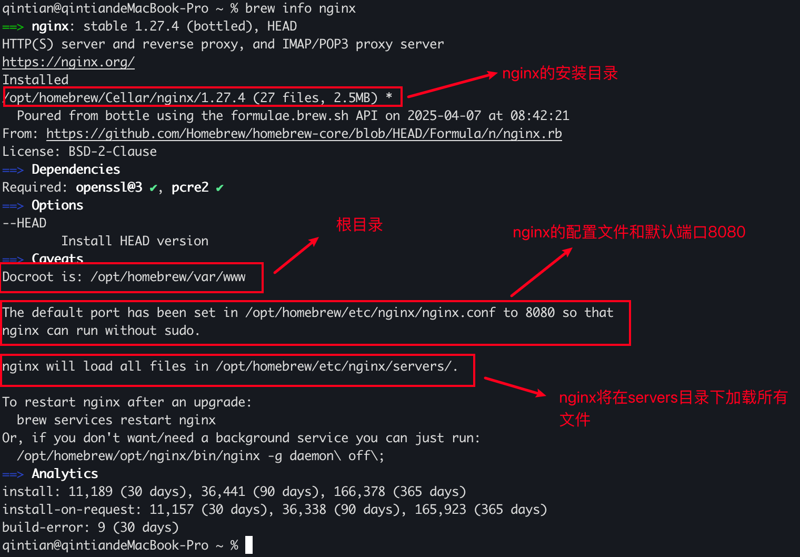
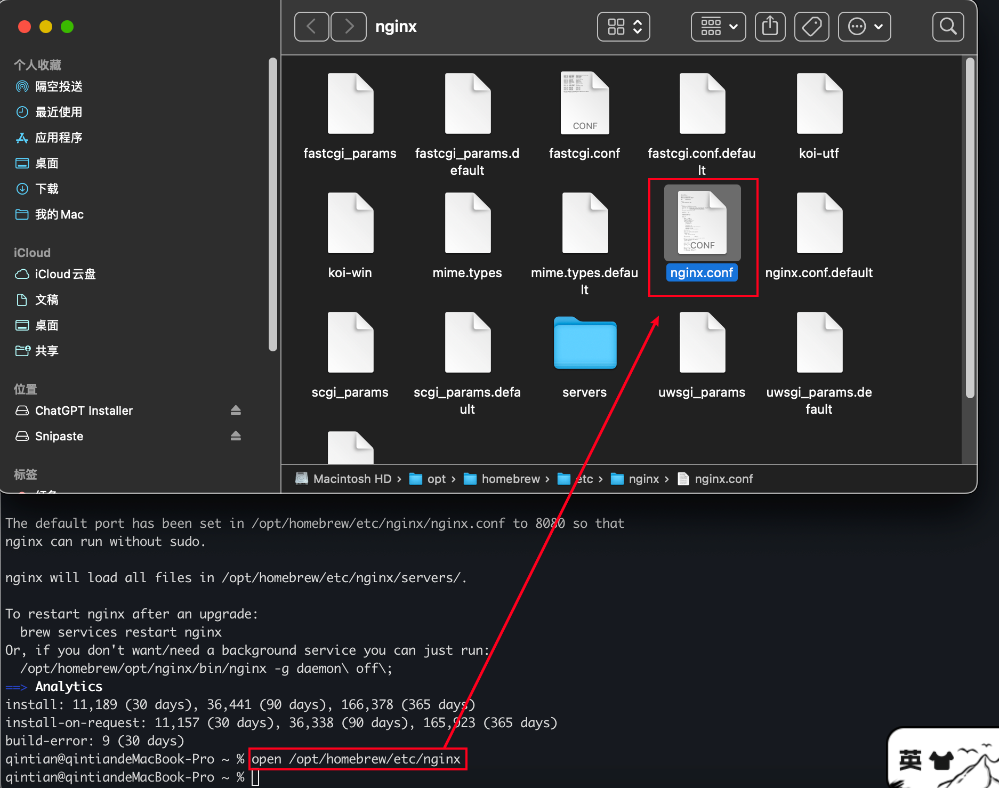
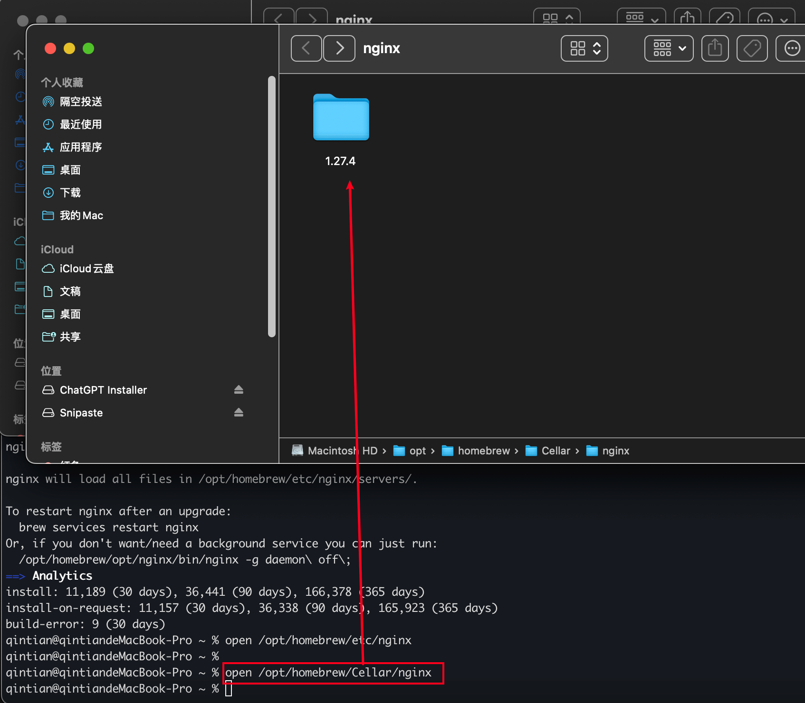
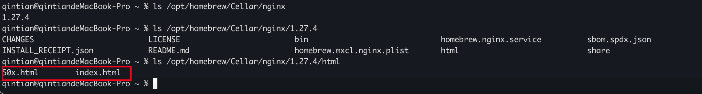
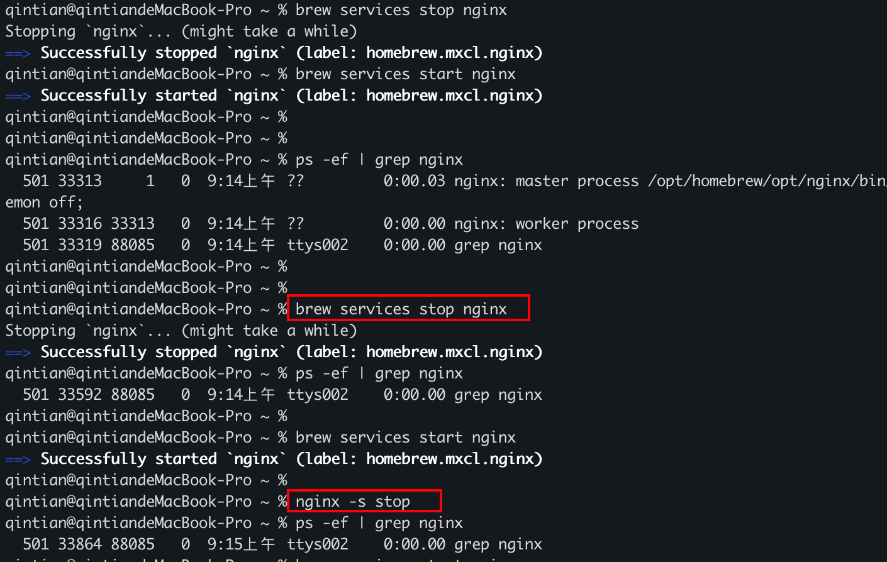
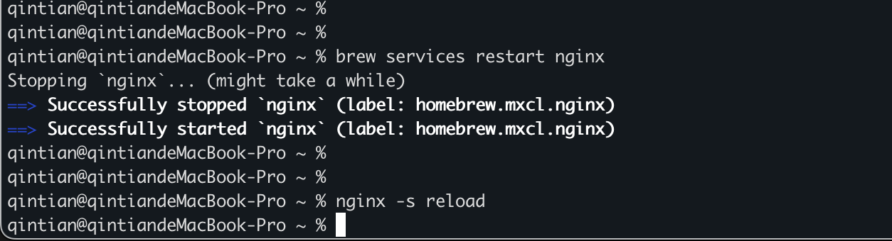
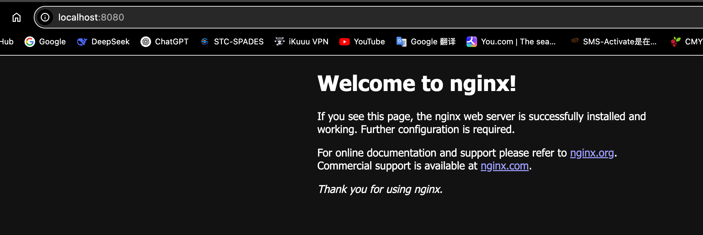

# Nginx 

## 1、Nginx 基本概念

> Nginx 是一个高性能的 HTTP 和反向代理的 Web 服务器。特点是占有内存小，并发能力强。

### 1.1、正向代理与反向代理

> 代理服务器：介于客户端和服务器之间的中间服务器，用来转发请求。

|代理分类|概念|特点|应用场景|
|-|-|-|-|
|正向代理|代表客户端向服务器发送请求，客户端主动配置代理地址|<li>隐藏客户端身份：服务器仅看到代理的 IP，而非真实客户端。<li>访问控制：限制或监控客户端访问特定资源（如企业网络管理）<li>绕过限制：突破地域或网络封锁（如访问被屏蔽的网站）<li>正向代理关注客户端隐私和控制|<li>公司内网通过代理访问外网。<li>用户通过 VPN 或科学上网工具访问受限内容|
|反向代理|代表服务器接收客户端请求，在服务端配置，对客户端透明|<li>隐藏服务器身份：客户端仅接触代理，无法直接访问后端服务器<li>负载均衡：将请求分发到多个后端服务器<li>安全防护：作为安全层抵御 DDoS 攻击、过滤恶意流量<li>SSL终端：处理 HTTPS 加密/解密，减轻后端压力<li>反向代理侧重服务端的负载与安全|<li>高流量网站使用 Nginx 处理并发请求|

## 2、环境搭建
### 2.1、MacOS 搭建 nginx

在 Mac 上安装 nginx，首先需要安装 Homebrew。关于这个包管理器的相关说明，可以参考 [Homebrew](https://github.com/SolaTian/MacOS/blob/main/Homebrew.md)

#### 2.1.1、安装 nginx

使用命令`brew install nginx`安装 nginx，安装完成之后，使用`brew info nginx`查看nginx 的安装信息如下图所示

在图上可以查看到几点重要的信息

#### 2.1.2、打开 nginx 配置文件

使用 `open /opt/homebrew/etc/nginx` 打开配置文件所在目录

#### 2.1.3、打开 nginx 安装目录

使用 `open /opt/homebrew/Cellar/nginx`

安装目录下有个 html 文件夹，里面存放着 2 个 html 文件，其中 index.html 是 nginx 的欢迎页面，50x.html 是 nginx 的报错页面。

#### 2.1.4、启动 nginx 服务

在命令行中启用 nginx 

`brew services start nginx`

后续再次启动 nginx 时可以先执行命令 `brew services stop nginx`

如果手动修改了 nginx.conf 文件，则在启动 nginx 之前，可以先使用 `nginx -t` 检查一下 nginx.conf 是否存在语法错误

#### 2.1.5、关闭和重启 nginx 服务

使用 `brew services stop nginx` 和 `brew services restart nginx` 分别对 nginx 进行关闭或者重启

#### 2.1.6、访问 nginx

了解 nginx 的基本操作之后，后面就可以使用浏览器访问 nginx 了

### 2.2、Windows 搭建 nginx

## 3、搭建一个通用的 nginx 服务器

### 3.1、丰富多样的协议

在客户端开发时，常常会有各种各样的平台或者服务端协议。设想一下，如果能够在这些协议中抽象出一些通用的参数选项保存在一个如`protocol_para.conf`文件中，比如 `protocol=...`，是不是只要根据协议种类手动的修改一下如`protocol=HTTP`或者`protocol=HTTPS`。通过这种方式，可以将各种协议都抽象成一种标准的`conf`文件。抽象出来的参数选项越多，那么这个`protocol_para.conf`文件适用的协议类型就越多。

#### 3.1、总结自己的 protocol_para.conf 文件

万事开头难，想要用 nginx 来自动化搭建对应协议的服务端 demo ，就需要尽可能多的对这些协议进行总结。下面只从笔者日常开发中遇到的协议来进行总结，后续遇到新的协议，可以在 `protocol_para.conf`文件中继续总结

应用层：
1. HTTP 协议（是否支持认证等）
2. HTTPS 协议
3. 私有协议 （如结构体+数据）

传输层：
1. TCP（分为短连接和长连接）

数据格式还可以包括 基础的二进制、RSA 加密、AES 加密、base64 转码，UTF8转码等。

协议内容很多，可以根据不同的应用层协议分成不同的文件，如 HTTP 和 HTTPS 使用`protocol_http.conf`，私有协议使用
